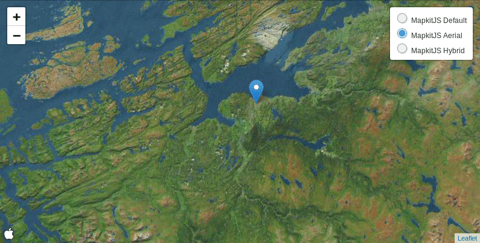

# Leaflet.MapkitMutant

A [LeafletJS](http://leafletjs.com/) plugin to
use [Apple's mapkitJS](https://developer.apple.com/documentation/mapkitjs) maps as a base layer.

The name comes from [GoogleMutant](https://gitlab.com/IvanSanchez/Leaflet.GridLayer.GoogleMutant). It's catchy, even if
MapkitMutant doesn't use DOM mutation observers.
This plugin is a fork of the original [Leaflet.MapkitMutant](https://gitlab.com/IvanSanchez/Leaflet.MapkitMutant) by
[Ivan Sanchez Ortega](https://gitlab.com/IvanSanchez).



## Usage

### Minimal Example

This is the minimal example to get a mapkit map up and running. It loads the mapkit and leaflet libraries from the CDN,
and then the plugin itself. The plugin requires an authorization token to work, which you can get from the Apple
Developer portal. Replace `Your authorization token goes here` with your actual token.

```html
<!DOCTYPE html>
<html lang="en">
<head>
  <title>Leaflet MapKit Playground</title>
  <script src="https://cdn.apple-mapkit.com/mk/5.x.x/mapkit.js"></script>
  <script src="https://unpkg.com/leaflet@latest/dist/leaflet.js"></script>
  <link rel="stylesheet" href="https://unpkg.com/leaflet@latest/dist/leaflet.css" />
  <script src="https://unpkg.com/@independo/leaflet.mapkitmutant@latest"></script>
  <style>
    #map {
      height: 1000px;
      width: 1000px;
    }
  </style>
</head>
<body>
<div id="map"></div>
<script>
  var map = L.map("map").setView([48.20849, 16.37208], 16);
  var mapkit = L.mapkitMutant({
    authorizationCallback: (done) => {
      done("Your authorization token goes here");
    },
  }).addTo(map);
</script>
</body>

</html>
```

### Advanced Example

**Load time optimization**
For better control over the version of the plugin and faster loading times it is recommended to use links to specific
versions:

```html

<script src="https://cdn.apple-mapkit.com/mk/5.32.x/mapkit.js"></script>
<script src="https://unpkg.com/leaflet@1.9.4/dist/leaflet.js"></script>
<link rel="stylesheet" href="https://unpkg.com/leaflet@1.9.4/dist/leaflet.css" />
<script src="https://unpkg.com/@independo/leaflet.mapkitmutant@1.0.0/dist/leaflet.mapkitmutant.js"></script>
```

**Mapkit options**
You can pass options to configure the mapkit map. For example, you can set the map type to satellite:

```javascript
  var mapkit = L.mapkitMutant({
  authorizationCallback: (done) => {
    done("Your authorization token goes here");
  },
  mapkitOptions: {
    mapType: mapkit.Map.MapTypes.Satellite
  }
}).addTo(map);
```

or show only specific points of interest:

```javascript
  var mapkit = L.mapkitMutant({
  authorizationCallback: (done) => {
    done("Your authorization token goes here");
  },
  mapkitOptions: {
    pointOfInterestFilter: mapkit.PointOfInterestFilter.including([
      mapkit.PointOfInterestCategory.Restaurant,
      mapkit.PointOfInterestCategory.PostOffice]
    ),
  },
}).addTo(map);
```

The full list of options can be found in
the [Apple documentation](https://developer.apple.com/documentation/mapkitjs/mapconstructoroptions#3001292).

## Known issues

* "I only see a rectangle when zooming out"

This happens because MapkitJS has a very particular behaviour for very low
zoom levels: it will refuse to use the given `CoordinateSpan` if that would
mean displaying over 180 degrees of longitude or so.

The current workaround is to scale down the size of the MapkitMutant so it overlaps
the region it reports to cover.

In practical terms, this means that users should add `minZoom: 3` to their maps
(or set the `maxBounds` of the map to something less than 180 degrees of longitude,
or any other similar approach). Else, users will not see parts of the map as grey.

* "I want routing, and placename search, and traffic, and streetview"

Nope. this plugin is **only** for the mapkitjs basemaps. It doesn't provide
routing, nor search, nor POIs. If you want that, consider implementing it
yourself.

## Legalese

Licensed under LGPL3. Because why not. See the LICENSE file for details.

# Contributors

|                 | Name                                                               |                                                                      |
|-----------------|--------------------------------------------------------------------|----------------------------------------------------------------------|
| Original Author | [Ivan Sanchez Ortega](https://gitlab.com/IvanSanchez)              | [Original Repo](https://gitlab.com/IvanSanchez/Leaflet.MapkitMutant) |
| TypeScript port | Konstantin Strümpf for [Independo GmbH](https://www.independo.app) |                                                                      |
